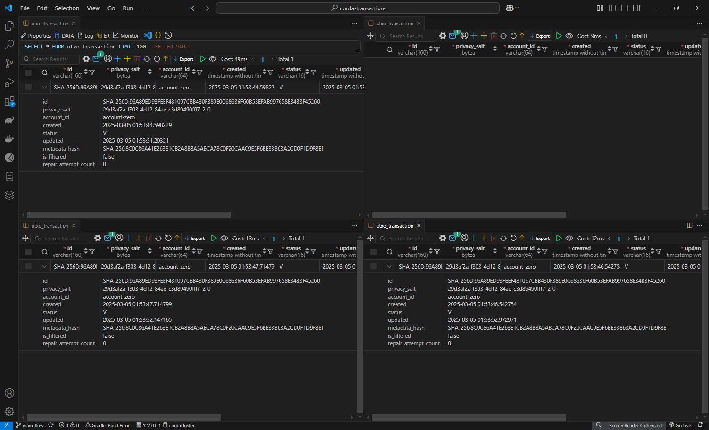
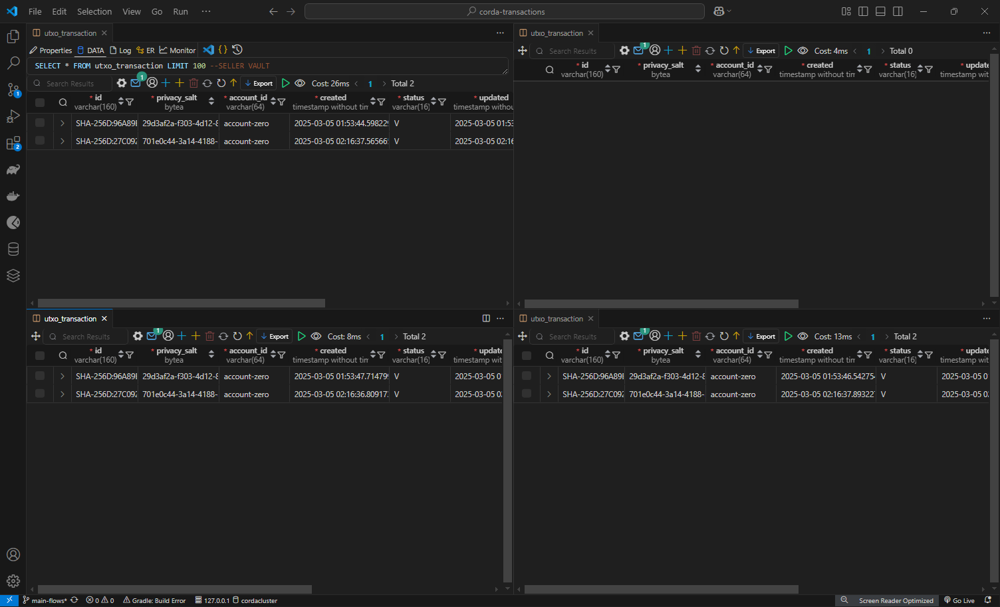
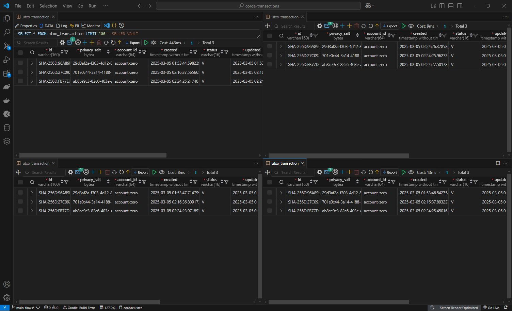
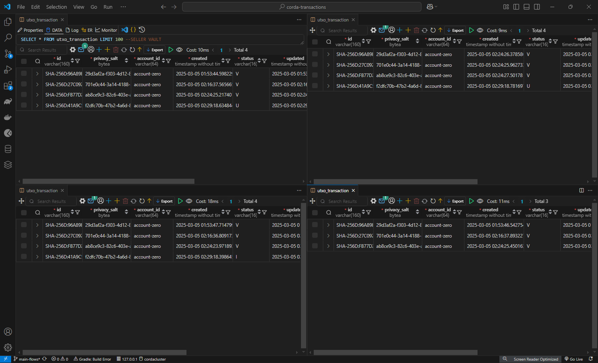

# corda-transactions

When working with the Corda platform, every transaction is stored in the participants'
vaults. The vault is a where all the transactions involving the owner are securely saved.
Each vault is unique and accessible only by its owner,
serving as a ledger to track all the owner's transactions.


This repo is the usecase of using RLN DLT Network using Corda 2.5 for Bill of Exchange Settlement. The members are already registered whose list is available in [`static-network-config.json`](config\static-network-config.json)

### Backend
1. Clone repository [`https://github.com/sanskriti-ltc/corda-transactions`](https://github.com/sanskriti-ltc/corda-transactions)
2. Install `java17`
3. Install `corda-cli 5.2.0.0`
4. Change the corda cli path in [docker-compose](config\combined-worker-compose.yaml)
5. run command:
```shell
docker-compose -f .\config\combined-worker-compose.yaml up --build
```
6. Run the command
```shell
./gradlew clean build
./gradlew tasks
./gradlew vNodesSetup
```
7. Run following command to get all vNodes info
```shell
./gradlew listVNodes
```
8. API list will be available at [`https://localhost:8888/api/v5_2/swagger#`](https://localhost:8888/api/v5_2/swagger#)

# Frontend
1. Clone repository [`https://github.com/priyankasahu23/IBillExchange`](https://github.com/priyankasahu23/IBillExchange)
2. Open cloned repo in terminal
3. go to the `ui` folder
```
cd ui
```
4. Run `docker-compose` command
```
docker-compose up --build -d
```
5. Open UI in the browser  [`https://localhost:4200`](https://localhost:4200)

## Running the Demo Flows

### Issue flow POST
- **Performed by**: Seller
- **Action**: Issue a Token
- **Vaults updated**:
	- Seller
	- Buyer
	- Buyer Bank
- **Request Body**:
```JSON
{
    "clientRequestId": "createiou-1",
    "flowClassName": "com.r3.developers.samples.obligation.workflows.IOUIssueFlow",
    "requestBody": {
        "amount": "1000",
        "currency": "INR",
        "drawee": "CN=ICICI Bank, OU=Banking Dept, O=ICICI Bank, L=India, C=IN",
        "payee": "CN=ABC Imports, OU=Imports Dept, O=ABC Imports, L=India, C=IN",
        "issueDate": "2024-02-20",
        "dueDate": "2025-09-30",
        "endorsements": [],
        "termsAndConditions": "Payment due on demand or by the specified due date. Interest rate of 5% per annum if unpaid by due date"
    }
}
```

Above image is showcasing the vault (postgres db) entries in below format
```
Seller vault | Regulatory Bank Vault
------------- ----------------
Buyer Vault  | Buyer Bank Vault
```

### List flow POST
- **Performed by**: Anyone
- **Action**: List tokens in a vault
- **Request Body**:
```JSON
{
    "clientRequestId": "list-1",
    "flowClassName": "com.r3.developers.samples.obligation.workflows.ListIOUFlow",
    "requestBody": {}
}
```
### List flow result GET
- **Performed by**: Anyone
- **Action**: List tokens in a vault
- **Response Body**:
```JSON
{ 
	"holdingIdentityShortHash": "473B8EB1ED00", 
	"clientRequestId": "list-1", 
	"flowId": "3151884a-4bc8-4097-ac79-d456fe4132c9", 
	"flowStatus": "COMPLETED", 
	"json": [ 
		{ 
			"id": "b6a7e1b3-7da7-44ab-9466-0dfe6e874c51", 
			"amount": 1000, 
			"currency": "INR", 
			"drawee": "CN=ICICI Bank, OU=Banking Dept, O=ICICI Bank, L=India, C=IN", 
			"drawer": "CN=Global Exports, OU=Exports Dept, O=Global Exports, L=London, C=GB", 
			"payee": "CN=ABC Imports, OU=Imports Dept, O=ABC Imports, L=India, C=IN", 
			"issueDate": 1708387200, 
			"dueDate": 1759190400, 
			"acceptance": false, 
			"availisation": false, 
			"paid": null, 
			"endorsements": [], 
			"boeDocs": "automatedBoeDocs", 
			"termsAndConditions": "Payment due on demand or by the specified due date. Interest rate of 5% per annum if unpaid by due date", 
			"iso2022Message": "automatedIso2022Message" 
		} 
	], 
	"flowError": null, 
	"timestamp": "2025-03-05T02:10:38.594Z" 
}
```
### Accept flow POST
- **Performed by**: Buyer
- **Action**: Accept a Token
- **Vaults updated**:
	- Seller
	- Buyer
	- Buyer Bank
- **Request Body**:
```JSON
{
    "clientRequestId": "acceptiou-1",
    "flowClassName": "com.r3.developers.samples.obligation.workflows.IOUAcceptFlow",
    "requestBody": {
        "payeeAcceptance":"true",
        "iouID":"b6a7e1b3-7da7-44ab-9466-0dfe6e874c51"
    }
}
```

Above image is showcasing the vault (postgres db) entries in below format
```
Seller vault | Regulatory Bank Vault
------------- ----------------
Buyer Vault  | Buyer Bank Vault
```
### Compliance flow POST
- **Performed by**: Anyone
- **Action**: Avalises a token and updates the regulatory bodies for compliance
- **Vaults updated**:
	- Seller
	- Buyer
	- Buyer Bank
	- Regulatory Bodies
- **Request Body**:
```JSON
{
    "clientRequestId": "complianceiou-1",
    "flowClassName": "com.r3.developers.samples.obligation.workflows.IOUComplianceFlow",
    "requestBody": {
        "iouID": "b6a7e1b3-7da7-44ab-9466-0dfe6e874c51"
    }
}
```

Above image is showcasing the vault (postgres db) entries in below format
```
Seller vault | Regulatory Bank Vault
------------- ----------------
Buyer Vault  | Buyer Bank Vault
```
### Settle flow POST
- **Performed by**: Buyer
- **Action**: Token is settle (paid) by buyer to seller
- **Vaults updated**:
	- Seller
	- Buyer
- **Request Body**:
```JSON
{
    "clientRequestId": "settleiou-1",
    "flowClassName": "com.r3.developers.samples.obligation.workflows.IOUSettleFlow",
    "requestBody": {
        "iouID":"b6a7e1b3-7da7-44ab-9466-0dfe6e874c51"
    }
}
```

Above image is showcasing the vault (postgres db) entries in below format
```
Seller vault | Regulatory Bank Vault
------------- ----------------
Buyer Vault  | Buyer Bank Vault
```
All images of the vault were sourced through `Database Client JDBC` extension in `VSCode` by establishing a connection
to the `CorDapp` using `PostgreSQL`. The credentials utilized for this connection are as follows:
```yaml
POSTGRES_DB=cordacluster
POSTGRES_USER=user
POSTGRES_PASSWORD=password
```

To access the vault, navigate through the hierarchy in
PostgreSQL: `Databases > cordacluster > Schemas > vnode_vault_(HASH_ID_OF_VNODE) >
Tables > utxo_transaction`. To view the transactions,
simply double-click on utxo_transaction.

#### Reference Repository: [`https://github.com/corda/corda5-samples`](https://github.com/corda/corda5-samples)