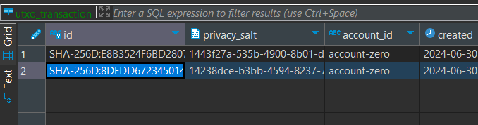
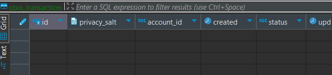
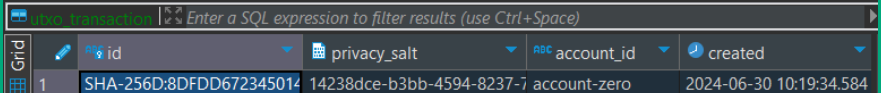

# sendAndReceiveTransaction

When working with the Corda platform, every transaction is stored in the participants'
vaults. The vault is a where all the transactions involving the owner are securely saved.
Each vault is unique and accessible only by its owner,
serving as a ledger to track all the owner's transactions.
However, there are scenarios where you may want a third party to receive a copy of the
transaction. This is where the SendAndRecieveTransaction function becomes essential.
For instance, if Alice conducts a transaction with Bob and wants Charlie to receive a copy,
Alice can simply run a flow using the transaction ID to send a copy to Charlie's vault.
Another application of this function can be an automated reporting tool,
which can be utilized at the end of each transaction finalizing flow to automatically
report to a specific vnode. This functionality can act like a bookkeeper,
meticulously tracking each transaction and ensuring accurate record-keeping.
`

### Setting up

1. We will begin our test deployment with clicking the `startCorda`. This task will load up the combined Corda workers in docker.
   A successful deployment will allow you to open the REST APIs at: https://localhost:8888/api/v5_2/swagger#/. You can test out some
   functions to check connectivity. (GET /cpi function call should return an empty list as for now.)
2. We will now deploy the cordapp with a click of `5-vNodeSetup` task. Upon successful deployment of the CPI, the GET /cpi function call should now return the meta data of the cpi you just upload


### Running the app

In Corda 5, flows will be triggered via `POST /flow/{holdingidentityshorthash}` and flow result will need to be view at `GET /flow/{holdingidentityshorthash}/{clientrequestid}`
* holdingidentityshorthash: the id of the network participants, ie Bob, Alice, Charlie. You can view all the short hashes of the network member with another gradle task called `ListVNodes`
* clientrequestid: the id you specify in the flow requestBody when you trigger a flow.

#### Step 1: Create IOUState between two parties
Pick a VNode identity to initiate the IOU creation, and get its short hash. (Let's pick Alice. Don't pick Bob because Bob is the person who alice will borrow from).

Go to `POST /flow/{holdingidentityshorthash}`, enter the identity short hash(Alice's hash) and request body:
```
{
    "clientRequestId": "createiou-1",
    "flowClassName": "com.r3.developers.samples.obligation.workflows.IOUIssueFlow",
    "requestBody": {
        "amount":"20",
        "lender":"CN=Bob, OU=Test Dept, O=R3, L=London, C=GB"
        }
}
```

After trigger the create-IOU flow, hop to `GET /flow/{holdingidentityshorthash}/{clientrequestid}` and enter the short hash(Alice's hash) and client request id to view the flow result
The stateRef of the transaction will be returned as a result of the flow query. Which is the "flowResult".

#### Step 2: Sending a copy of the transaction to a third party.
If a member needs to share a copy of their transaction with another member,
they can do so using the process outlined below. For instance,
if Alice wishes to send a copy of the transaction to Dave,
we can execute the following request body with her short hash:

```
{
    "clientRequestId": "sendAndRecieve-1",
    "flowClassName": "com.r3.developers.samples.obligation.workflows.sendAndRecieveTransactionFlow",
    "requestBody": {
        "stateRef": "STATEREF ID HERE",
        "members": ["CN=Dave, OU=Test Dept, O=R3, L=London, C=GB"],
        "forceBackchain": "false"
    }
}
```

Ensure to replace the stateRef variable with the stateRef of the transaction. The stateRef will be found when you run the GET call,
QueryAll in the swaggerAPI. The stateRef is labeled as `flowResult` in response body， begins with SHA-256D:XXXXX..
```
[
  {
    "holdingIdentityShortHash": "A93A019B324E",
    "clientRequestId": "createiou-1",
    "flowId": "26ea3f95-141b-4aaa-9b58-e3a685dc54d3",
    "flowStatus": "COMPLETED",
    "flowResult": "SHA-256D:B3D87C8B446C277B5658BBB2A18DC7491539D898B70F074418878091AE315B4A",
    "flowError": null,
    "timestamp": "2024-07-08T04:37:16.175Z"
  }
]
```
After running this flow Dave will have the transaction in his vault.


Results

Currently, Alice has two transactions stored in her vault.
The transaction we aim to send to Charlie is identified by the ID SHA-256D:8DFDD672….
You can view Alice's transactions in the image provided below:

<p align="center">
  
</p>

On the other hand, Charlie’s vault currently holds no transactions,
as illustrated in the image below:

<p align="center">
  
</p>

Once Alice executes the flow, Charlie’s vault is updated to include the transaction,
which is displayed as follows:

<p align="center">
  
</p>

All images of the vault were sourced through DBeaver by establishing a connection
to the Cordapp using PostgreSQL. The credentials utilized for this connection are as follows:

POSTGRES_DB = cordacluster <br>
POSTGRES_USER = postgres <br>
POSTGRES_PASSWORD = password

To access the vault, navigate through the hierarchy in
PostgreSQL: Databases > cordacluster > Schemas > vnode_vault_(HASH_ID_OF_VNODE) >
Tables > utxo_transaction. To view the transactions,
simply double-click on utxo_transaction.